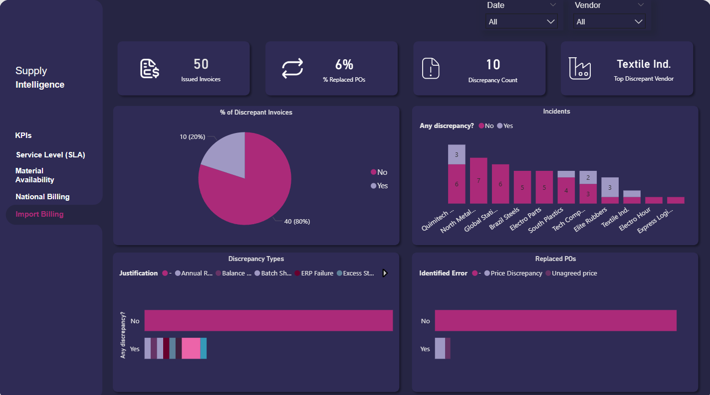

# Dashboard de Inteligência de Suprimentos (Supply Intelligence)

## **Visão Geral do Projeto**
Este projeto de Business Intelligence oferece uma visão estratégica 360° das operações de Supply Chain, focado em **SLA**, **Disponibilidade de Material** e **Monitoramento de Faturamento**. O objetivo é transformar bancos de dados complexos e robustos em insights de fácil visualização e entendimento, apoiando as decisões estratégicas.

---

## **🔍 Detalhamento das Etapas**

### **1. Visão Geral (KPIs)**
Acompanhamento dos indicadores macro relacionados a desempenho dos fornecedores e disponibilidade do material no estoque.
> 

### **2. Análise de Nível de Serviço (SLA)**
Monitoramento de **Fulfillment Rate**, com análise de causa raiz para atrasos e gargalos logísticos.
> 

### **3. Disponibilidade de Material**
Gestão de estoque focada no **Inventory Readiness Index** para evitar rupturas na produção.
> 

### **4. Auditoria de Faturamento**
Controle de integridade financeira através do rastreamento de divergências e monitoramento de cancelamentos.

**Faturamento Nacional:**
> 

**Faturamento Importação:**
> 

---

## **Habilidades Técnicas Aplicadas**
* **Saneamento de Dados**: Limpeza e estruturação de bases de ERP para garantir a integridade da informação.
* **DAX Avançado**: Criação de medidas dinâmicas para análise de performance e variância.
* **Data Visualization**: UI/UX Design com paleta de cores em Dark Mode para leitura executiva.

---

> **Nota de Privacidade**: Este repositório contém apenas visualizações para portfólio. Dados sensíveis e nomes reais de empresas foram omitidos ou alterados para garantir a total confidencialidade corporativa.
